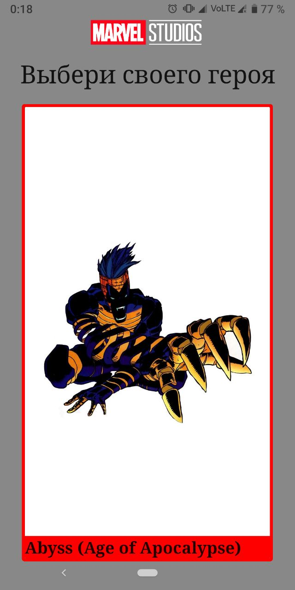
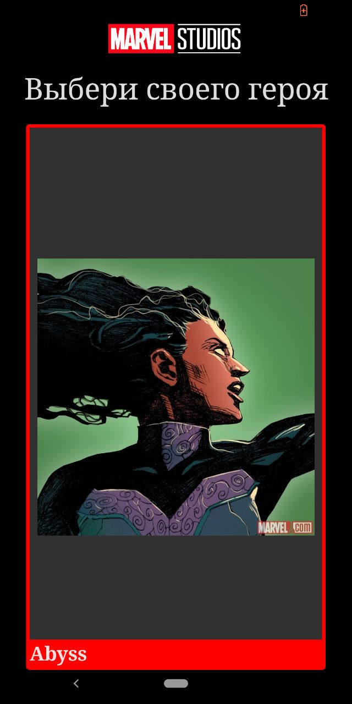
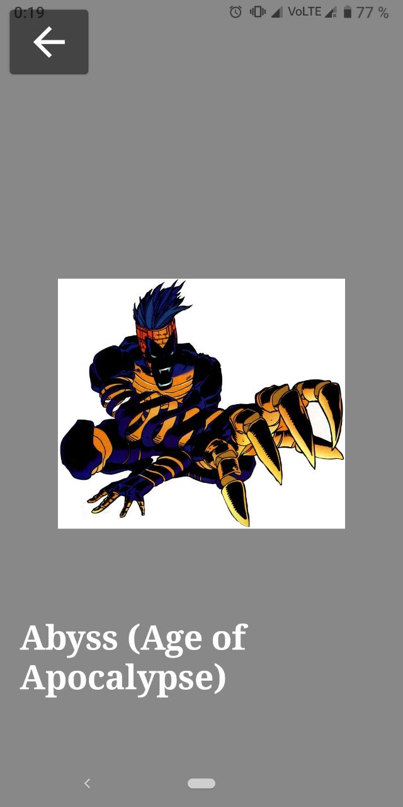

# labeffective HeroApp

## Why was this project created?

This is my android learning project.

## Screenshots

### Main screen

|Light Theme                   |Dark Theme                   |
|:----------------------------:|:---------------------------:|
||| 

### Hero screen

|Light Theme                   |Dark Theme                   |
|:----------------------------:|:---------------------------:|
||| 

## Topics

* Navigation
* Architecture
* Theming
* Network
* Compose Based UI
* Gradle Configuration
* Room
* MVI

## How to run
* You need Android Studio (at least Arctic Fox) with Kotlin plugin (at least 1.6.10)
* Add `apiKey=<YourKey>` in `local.properties` file, for example `apiKey="85366ee982e642d7957abb89a7559431"`
* Run -> Run 'app'

## Who to contact with questions
*[Egor Korolenko] (https://github.com/egorkorolenko) 
